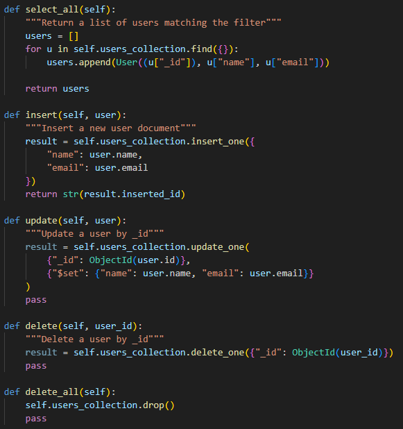
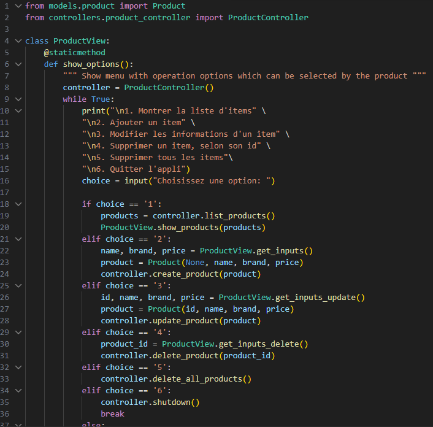

**Question 1** : Quelles commandes avez-vous utilisées pour effectuer les opérations UPDATE et DELETE dans MySQL ? Avez-vous uniquement utilisé Python ou également du SQL ? Veuillez inclure le code pour illustrer votre réponse.

J'ai utiliser python et du sql, j'ai utiliser python pour faire des fonctions qui vont soumettre des requete SQL.

**Question 2** : Quelles commandes avez-vous utilisées pour effectuer les opérations dans MongoDB ? Avez-vous uniquement utilisé Python ou également du SQL ? Veuillez inclure le code pour illustrer votre réponse.

Aucune commande SQL n'est necessaire, toutes les commandes faites avec MONGODB sont en python uniquement car mongo est utiliser comme un language oriente objet.

**Question 3** : Comment avez-vous implémenté votre `product_view.py` ? Est-ce qu’il importe directement la `ProductDAO` ? Veuillez inclure le code pour illustrer votre réponse.

J'ai utiliser le modele de conception MVC, product_view n'interagie pas directement avec le DAO. Seulement le controlleur a access au ProductDAO, donc la vue importe le controlleur pour acceder au information a travers celui-ci.

**Question 4** : Si nous devions créer une application permettant d’associer des achats d'articles aux utilisateurs (`Users` → `Products`), comment structurerions-nous les données dans MySQL par rapport à MongoDB ?

En SQL, nous devrons avoir une table de liaison, tandis que dans MongoDB nous pouvons ajouter l'information achat comme champs d'un user. Ses champs serais donc: id, nom, email, achats. Les achats pourrait etre une liste d'achats. 