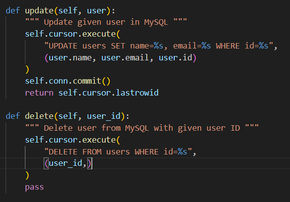

**Question 1** : Quelles commandes avez-vous utilisées pour effectuer les opérations UPDATE et DELETE dans MySQL ? Avez-vous uniquement utilisé Python ou également du SQL ? Veuillez inclure le code pour illustrer votre réponse.

J'ai utiliser python et du sql, j'ai utiliser python pour faire des fonctions qui vont soumettre des requete SQL.

**Question 2** : Quelles commandes avez-vous utilisées pour effectuer les opérations dans MongoDB ? Avez-vous uniquement utilisé Python ou également du SQL ? Veuillez inclure le code pour illustrer votre réponse.

**Question 3** : Comment avez-vous implémenté votre `product_view.py` ? Est-ce qu’il importe directement la `ProductDAO` ? Veuillez inclure le code pour illustrer votre réponse.

**Question 4** : Si nous devions créer une application permettant d’associer des achats d'articles aux utilisateurs (`Users` → `Products`), comment structurerions-nous les données dans MySQL par rapport à MongoDB ?